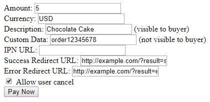

# Admin Interface

The admin interface can be access at the path `/admin`, e.g. `http://example.com:38071/admin`.

You need to log in using the `CLIENT_AUTH_USERNAME` and `CLIENT_AUTH_PASSWORD` defined in the `.env` file (the same credentials which are used with the API).

You will then see this interface:

The "Server Wallet Balance" section will displays the available and locked balance of the wallet. Available means you are free to access these funds. Locked means the funds did not yet receive enough confirmations to be transferred.

_You can manage the wallet, and transfer funds from it, using the BitcoiNote GUI Wallet software on your computer, with the `gateway.wallet` file that you created on the server during setup. You can also set up automatic wallet sweeping (see [Advanced Usage](advanced-usage.md))._

Below the wallet balance, you can see a table with all the transactions stored in the gateway. Transactions are stored for 30 days (this can be customized, see [Config Variables Reference](config-variables-reference.md)).

There are three action buttons for each transaction:

* **Info** (information icon):  
  Show details about this transaction. This simply displays the transaction model as JSON, whose fields are explained in the [API Reference](api-reference.md).
* **Cancel** (cross icon):  
  Cancel the transaction. Only available for pending transactions.
* **Delete** (trash icon):  
  Delete the transaction.

To see the full payment ID, hover over it or use the info button.

There may be transactions which show a red text with an amount "to be refunded". These are transactions where the user sent too much money, or they had already sent some money (but not all of it) when the transaction expired.

The gateway does not track expired or cancel transactions further. If a customer claims to have sent additional money, search by the payment ID in your BitcoiNote GUI Wallet.

If the Form Submit functionality is enabled, you also see a link `Test Form` at the bottom. It opens a demo form which is also a convenient way to test the gateway:

-----

Continue reading: [Advanced Usage](advanced-usage.md)

[Back to Documentation Overview](index.md)
