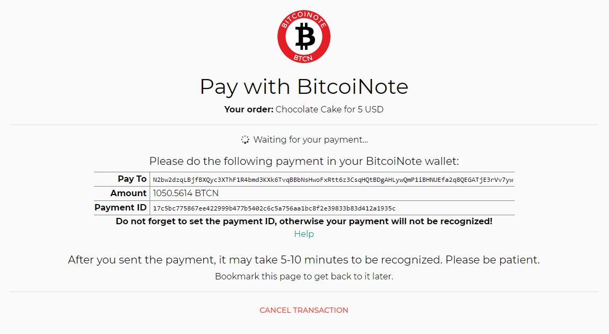

# Basics of Operation

## Components Overview

The BTCN Gateway Service takes a role as middle-man between the merchant's BTCN wallet and the merchant's eCommerce application (e.g. online shop). In some instances, the BTCN Gateway Service can also interact with the end user directly (when the payment funnel page is used).

Its job is to keep track of transactions until the payment is completed (and while after) and provide all the necessary information which the user would need to complete the payment.

### Definitions

Throughout the documentation, we refer to the following components:

* BTCN Gateway Service (short "gateway"): The application whose documentation you are currently reading.
* eCommerce application: The merchant's existing web shop or similar web application (for example WordPress with WooCommerce)
* User: End user using the eCommerce application
* Admin: Administrator of the eCommerce application and the gateway
* Payment Funnel/Status Page (short "funnel page", "status page"): A webpage provided by the gateway which shows the user instructions how to pay, or a success/error message when the payment completed/failed

## Payment Flows

There are several ways to implement a payment flow with the BTCN Gateway Service.

### Initiation

To initiate a payment, there are two options available:

1. **Using the REST API.**  
   The eCommerce application backend will send a request to the API with the desired amount, currency, description, etc. and will receive back a payment ID and all information required for the user to complete the purchase (such as recipient address and BTCN amount). The eCommerce application can save the payment ID and can now either redirect the user to the gateway's payment funnel page or display payment instructions to the user directly in a custom way.
2. **Using the Form Submit feature.**  
   The eCommerce application frontend will submit an HTML form to the gateway's Form Submit endpoint with the desired amount, currency, description, etc. and the gateway will redirect the user to its payment funnel page.  
   **Note:** This way, the user is able to view and control the parameters sent to the gateway in his browser's developer console. Make sure you verify the parameters of the transaction from the backend upon successful payment to ensure the amount is correct and hasn't been tampered with!

### Status Update

To show payment instructions and status updates to the user, there are also two options available:

1. **Custom.**  
   The eCommerce application can display payment instructions in a custom way to the user, e.g. as info box directly inside the webshop. (It received the necessary information from the API previously.) Also, the eCommerce application can query the gateway's REST API to fetch the status of the transaction (to detect expiration or partial payments for example) and react on changes accordingly.
2. **Using the gateway's payment funnel page.**  (This is the only option if the payment was initiated via a form submit.)  
   The gateway will display a page to the user with instructions how to complete the payment. The user also has the option to cancel the transaction from there (this is configurable).  
     
   Once the payment has been verified or was cancelled/expired, the user is directed to a success/failure page. If a redirect URL for success/failure was configured, the user is then redirected back to the merchant's website after a few seconds.

### Success

When the payment was completed successfully (**after 1 verification on the blockchain** - this takes usually a few minutes), the gateway will send an IPN (Instant Payment Notification) to the eCommerce application backend.

The IPN is cryptographically signed. **The eCommerce application must verify the signature of the IPN as well as the parameters of the transaction**, in order to ensure no attacker has tampered with it. At this point (and **only** this point - not at the success redirect page!), the eCommerce application shall mark the customer's order as paid and continue processing it (e.g. deliver digital goods or initiate shipping).

If the payment funnel page was used and a success redirect URL was specified, it will now redirect the user to the merchant's success page.

### Failure

There are two ways a payment can fail: By **expiration** (after a configurable period of time, by default 4 hours) or **cancellation** (by user or admin).

In case of a failure, no IPN is sent. The eCommerce application can learn about the failed state of a transaction by querying the gateway's API.

If the payment funnel page was used and an error redirect URL was specified, it will now redirect the user to the merchant's error page. (In case of cancellation, this may for example simply show the user's cart again).

Note that in the event that the user already paid some amount (but less than the full amount), the merchant will have to refund the customer manually. These "leftover" funds are displayed in the admin interface.

## Transaction Properties

Transactions conceptually have the following important properties:

|Property|Explanation|
| --- | --- |
|Payment ID|ID which identifies the transaction and has to be set in the "Payment ID" field of the wallet by the user.|
|Status|Either `pending`, `completed`, `expired` or `cancelled`.|
|Description|A piece of text describing what the user purchased. This is visible to the user.|
|Custom Data|Arbitrary data which the eCommerce application can associate with the transaction. This is not visible to the user.|
|Original amount and currency|The amount and currency which was used to create the transaction (e.g. 5 USD). The gateway automatically converts this to BTCN.|
|BTCN amount|The amount in BTCN which has to be paid (e.g. 1000 BTCN).|
|Received amount|The amount of BTCN already received.|
|Amount to be refunded|Any overpaid amount of BTCN (or amount partly paid before a transaction expired). The admin has to take care of refunding it to the user (this amount is displayed in the admin interface).|
|IPN and redirect URLs|These URLs can be used to inform the eCommerce application about a successful payment (via IPN) and to redirect the user to the correct merchant page from the payment funnel page after the payment was completed or cancelled.|

A transaction will expire if it was still not completed (nor cancelled) after 4 hours (configurable). Note that payments for this transaction are then no longer tracked.

A transaction can be cancelled using the API or admin. It's possible to also allow the user to cancel the transaction from the payment funnel page (only if no payment was received yet).

Transactions are stored in the gateway, regardless of success or failure, for 30 days (configurable) or until they are deleted by the API or admin interface.

-----

Continue reading: [Installation and Configuration](installation-and-configuration.md)

[Back to Documentation Overview](index.md)
